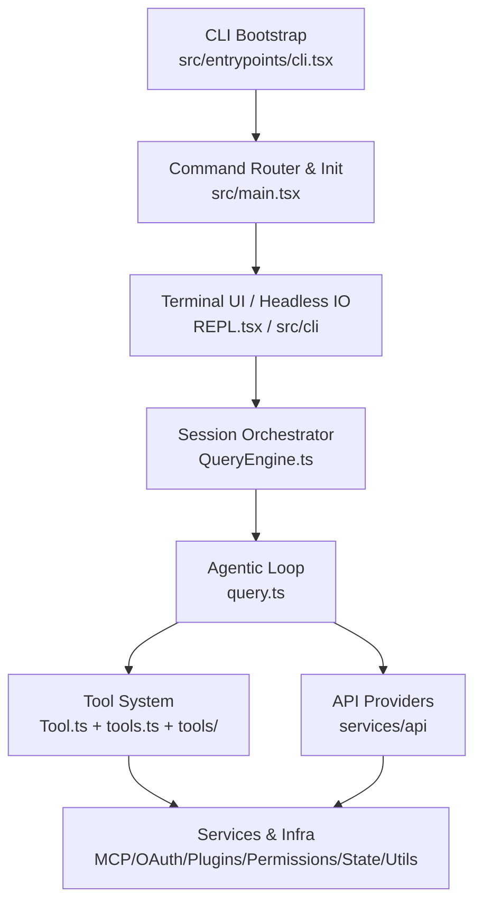
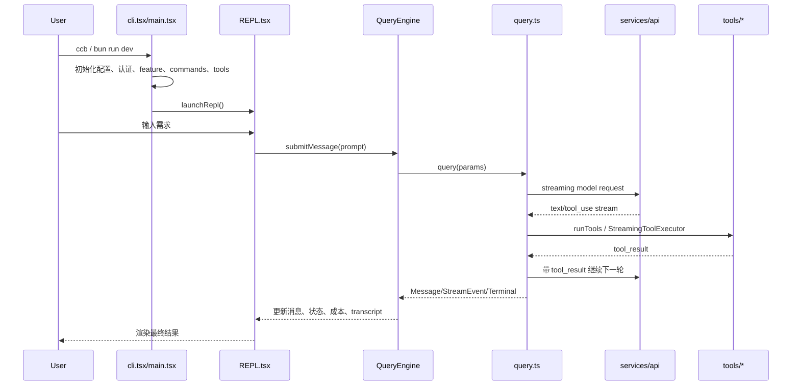

# Claude Code Best 源码项目分享

> 基于当前仓库 `D:\work\claude-code-bets` 的本地源码梳理。本文适合做团队技术分享、源码导读或二次开发入门材料。

## 1. 项目定位

`claude-code-best` 是一个以 Bun/TypeScript 实现的 Claude Code CLI 源码还原与增强项目。它的核心目标不是做一个普通聊天 CLI，而是复刻一套“终端里的 Agentic Coding Assistant”：

- 在终端中提供 React/Ink 驱动的交互式 REPL。
- 维护多轮会话、上下文、记忆、文件快照和 transcript。
- 将模型输出的 `tool_use` 转换为真实的文件读写、命令执行、检索、MCP 调用、子 Agent 等操作。
- 通过权限系统、Plan Mode、沙箱/规则、Hook 等机制把“AI 能做事”和“用户可控”结合起来。
- 支持多 Provider/API 适配，以及 Web Search、Computer Use、Voice、Bridge/Remote Control、Plugins、Skills 等扩展能力。

从工程形态看，它是一个大型 TypeScript 单仓库：主应用在 `src/`，扩展包在 `packages/`，文档在 `docs/`，测试分散在 `src/**/__tests__` 与 `tests/`。

## 2. 技术栈与工程配置

| 类别 | 使用情况 | 关键文件 |
| --- | --- | --- |
| 运行时 | Bun，要求 `bun >= 1.2.0`，README 中建议使用较新 Bun | `package.json`, `bun.lock` |
| 语言 | TypeScript + TSX，ESM 模块 | `tsconfig.json` |
| UI | React 19 + 自定义/工作区内 `@anthropic/ink` | `src/screens/REPL.tsx`, `packages/@ant/ink/` |
| CLI | Commander.js + 自研启动/渲染封装 | `src/main.tsx`, `src/interactiveHelpers.tsx` |
| 模型 SDK | Anthropic SDK，并额外有 OpenAI/Gemini/Grok 适配 | `src/services/api/` |
| 校验 | Zod v4、JSON Schema | `src/Tool.ts`, `src/schemas/` |
| 质量工具 | Biome、Bun test、Knip | `biome.json`, `knip.json` |
| 打包 | `Bun.build` + code splitting + 宏定义/feature flags | `build.ts`, `scripts/defines.ts` |
| 文档站 | Mintlify/MDX | `docs/`, `mint.json`, `docs.json` |

常用脚本：

```bash
bun install
bun run dev
bun run build
bun test
bun run lint
bun run health
```

构建入口是 `src/entrypoints/cli.tsx`，产物输出到 `dist/`，并复制 `vendor/audio-capture` 等原生依赖。`package.json` 中暴露两个 bin：`ccb` 和 `claude-code-best`。

## 3. 顶层目录结构

```text
.
|-- src/                 # 主应用源码：CLI、REPL、Agent Loop、工具、服务、状态、命令
|-- packages/            # workspace 包：Ink、Computer Use、NAPI、Remote Control Server 等
|-- docs/                # Mintlify/MDX 文档、架构图、功能说明、测试计划
|-- tests/               # 跨模块集成测试与 mocks
|-- scripts/             # 构建、开发、健康检查、postinstall/ripgrep 下载脚本
|-- vendor/              # 原生二进制/第三方 vendored 资源，如 audio-capture
|-- learn/               # 学习路线与问答材料
|-- figma/               # 设计相关材料
|-- build.ts             # Bun 构建脚本
|-- package.json         # workspaces、scripts、bin、依赖
|-- tsconfig.json        # TypeScript 配置
|-- biome.json           # 格式化与 lint 规则
|-- README.md            # 项目使用说明
```

当前本地文件规模大致如下：

| 目录 | 文件数 | TS/TSX 文件数 | 说明 |
| --- | ---: | ---: | --- |
| `src/` | 2839 | 2803 | 主体源码，绝大部分复杂度在这里 |
| `packages/` | 256 | 878 | workspace 包中有生成/嵌套源码与测试，统计包含递归内容 |
| `docs/` | 116 | 0 | 架构、功能、安全、上下文、工具等文档 |
| `tests/` | 8 | 6 | 集成测试与 mock fixtures |
| `scripts/` | 9 | 8 | 构建/开发辅助脚本 |
| `vendor/` | 7 | 1 | vendored 原生资源 |

## 4. `src/` 目录导读

`src/` 是项目核心，建议按“入口 -> UI -> 编排 -> 循环 -> 工具 -> 服务 -> 基础设施”的顺序阅读。

| 目录/文件 | 主要职责 |
| --- | --- |
| `src/entrypoints/cli.tsx` | 最外层 CLI bootstrap。处理 `--version`、Chrome/Computer Use/MCP、daemon worker、bridge 等快速路径，再动态加载 `main.tsx`。 |
| `src/main.tsx` | CLI 主路由和初始化中心。负责 Commander 命令解析、配置/认证/策略/遥测初始化、REPL/headless 分发。 |
| `src/replLauncher.tsx` | 动态加载 `App` 和 `REPL`，启动终端 UI。 |
| `src/screens/REPL.tsx` | React/Ink 交互界面。负责消息列表、输入框、任务面板、权限弹窗、状态栏、快捷键等。 |
| `src/QueryEngine.ts` | 会话级编排器。一轮/多轮对话状态、transcript、成本、文件历史、权限 denial、SDK 输出都由它组织。 |
| `src/query.ts` | 单轮 Agentic Loop 核心。流式请求模型、识别 `tool_use`、执行工具、压缩上下文、恢复错误、决定继续/终止。 |
| `src/Tool.ts` | Tool 类型系统、权限上下文、工具结果、工具构建器等基础接口。 |
| `src/tools.ts` | 内置工具注册表。根据 feature flag、环境变量、权限规则组装可用工具集合。 |
| `src/tools/` | 具体工具实现，如 `BashTool`、`FileReadTool`、`FileEditTool`、`AgentTool`、`WebSearchTool`、`MCPTool`。 |
| `src/services/` | API、MCP、OAuth、插件、压缩、LSP、分析、设置同步、Session Memory 等业务服务。 |
| `src/commands/` | 斜杠命令与 CLI 子命令实现，如 `/login`、`/config`、`/mcp`、`/review`、`/compact`。 |
| `src/hooks/` | REPL 中使用的 React hooks，包括工具权限、输入、历史、MCP、插件、任务、IDE 等。 |
| `src/state/` | AppState store，保存 UI、权限、任务、MCP、插件、bridge、agent 等运行时状态。 |
| `src/utils/` | 通用能力：消息转换、token 计算、权限规则、配置、shell、git、插件、文件历史、上下文等。 |
| `src/types/`, `src/schemas/`, `src/constants/` | 类型、schema、常量定义。 |
| `src/cli/` | headless/SDK/非交互路径相关逻辑，如 print、structured IO、rollback、bg 等。 |
| `src/bridge/`, `src/remote/`, `src/daemon/` | 远程控制、bridge、后台 daemon/worker 能力。 |
| `src/coordinator/`, `src/tasks/`, `src/assistant/` | 子 Agent、任务、协作/assistant 模式相关实现。 |

## 5. 分层架构

可以把项目理解成 7 层：



### 5.1 启动层：极致延迟优化

`src/entrypoints/cli.tsx` 的设计重点是“先判断轻路径，再加载重模块”：

- `--version/-v/-V` 直接输出版本，不加载完整 CLI。
- 特殊模式如 Chrome MCP、Computer Use MCP、daemon worker、bridge 先在 bootstrap 层分支。
- 常规路径才动态 `import('../main.jsx')`。
- `feature('...')` 与 `FEATURE_*` 环境变量配合，方便构建时 dead code elimination。

这种写法对 CLI 很重要：用户频繁执行短命令时，不应该为 React、SDK、MCP、插件系统支付完整冷启动成本。

### 5.2 路由层：命令、配置和运行模式分发

`src/main.tsx` 是一个很大的编排入口，主要职责包括：

- 设置启动 profiler、MDM/keychain 预取、warning handler。
- 初始化配置、认证、GrowthBook/feature flags、policy limits、remote managed settings。
- 注册 Commander 子命令和全局 option。
- 加载工具、命令、MCP、插件、Skills、Agent 定义。
- 判断进入 REPL、headless/print、resume、remote/bridge、assistant 等运行路径。

命令体系本身由 `src/commands.ts` 聚合，它导入大量 `src/commands/*/index.ts`，同时用 `feature()` 和 `process.env.USER_TYPE` 对部分命令做延迟加载或条件启用。

### 5.3 UI 层：React/Ink 终端应用

`src/screens/REPL.tsx` 是一个超大 TSX 文件，体现了 Claude Code 终端体验的复杂度：

- 输入：文本输入、历史、搜索、粘贴、图片/文件、快捷键、slash command。
- 输出：消息流、工具进度、diff、代码高亮、任务/Agent 面板、transcript 视图。
- 状态：AppState store、Stats、FPS metrics、MCP clients、插件命令、权限上下文。
- 交互：权限确认、计划模式、IDE 集成、voice、buddy、remote bridge、通知。

`src/replLauncher.tsx` 会将 `components/App.tsx` 作为全局 Provider 包住 `REPL`，再通过 `@anthropic/ink` 渲染到终端。

### 5.4 会话编排层：`QueryEngine`

`src/QueryEngine.ts` 的定位是“每个会话一个引擎”。它将 UI/SDK 输入转换为可被 `query()` 消费的参数，并维护跨 turn 状态：

- `mutableMessages`：当前会话消息列表。
- `readFileState`：读文件缓存/文件快照相关状态。
- `permissionDenials`：工具权限拒绝记录，面向 SDK 输出。
- `totalUsage`：token/cost 累计。
- `discoveredSkillNames`、`loadedNestedMemoryPaths`：Skills/CLAUDE.md 注入去重。
- `abortController`：取消/中断控制。

简单说，`QueryEngine.submitMessage()` 做的是：

```text
用户输入
  -> processUserInput 处理 slash/local command/附件/普通提示词
  -> 构造 systemPrompt、userContext、systemContext、toolUseContext
  -> 调用 query() 异步生成器
  -> 将 Message/StreamEvent 转成 UI 或 SDK 可消费的输出
  -> 持久化 transcript、更新成本和 AppState
```

### 5.5 核心循环层：Agentic Loop

`src/query.ts` 是最核心的 Agentic Loop。它不是“一次请求模型就结束”，而是一个可持续多轮的状态机：

```text
while true:
  1. 预处理上下文：tool result budget / snip / microcompact / context collapse / autocompact
  2. 调用模型：以 streaming 方式接收 assistant message 和 tool_use
  3. 工具执行：并发或串行执行 tool_use，产出 tool_result
  4. 恢复与重试：处理 prompt-too-long、max-output-tokens、fallback、stop hook 等情况
  5. 判断终止：没有 tool_use、达到 maxTurns、被 abort、hook 阻止或错误不可恢复
```

这也是项目最值得分享的设计点：模型每产生一次工具调用，系统就把真实世界的观察结果写回消息流，再让模型继续推理。文件内容、命令输出、搜索结果、MCP 返回值都成为下一轮上下文的一部分。

### 5.6 工具层：把模型意图落到真实操作

工具系统由三部分组成：

- `src/Tool.ts`：定义 `Tool<Input, Output, Progress>`、`ToolUseContext`、权限上下文、结果结构。
- `src/tools.ts`：根据 feature flags、环境变量、权限规则、MCP/插件动态组装工具列表。
- `src/tools/*`：具体实现。

核心工具示例：

| 工具 | 目录 | 能力 |
| --- | --- | --- |
| Bash/PowerShell | `src/tools/BashTool/`, `src/tools/PowerShellTool/` | 执行 shell 命令，结合 AST/权限/沙箱判断危险操作 |
| FileRead/FileWrite/FileEdit | `src/tools/FileReadTool/`, `src/tools/FileWriteTool/`, `src/tools/FileEditTool/` | 读写改文件、diff 展示、路径权限检查 |
| Glob/Grep | `src/tools/GlobTool/`, `src/tools/GrepTool/` | 搜索和导航代码库 |
| AgentTool | `src/tools/AgentTool/` | 创建/恢复/运行子 Agent，支持内置 agent 定义 |
| Todo/Task | `src/tools/TodoWriteTool/`, `src/tools/Task*Tool/` | 任务管理与 Agent 工作流 |
| MCPTool | `src/tools/MCPTool/` | 调用外部 MCP server 暴露的工具 |
| WebFetch/WebSearch/WebBrowser | `src/tools/WebFetchTool/`, `src/tools/WebSearchTool/`, `src/tools/WebBrowserTool/` | Web 检索、抓取、浏览器/远程浏览能力 |
| LSPTool | `src/tools/LSPTool/` | 使用语言服务获取诊断、符号、格式化等信息 |
| SkillTool | `src/tools/SkillTool/` | 调用 Skills/插件提供的能力 |

工具执行由 `src/services/tools/toolOrchestration.ts` 和 `StreamingToolExecutor.ts` 管理：

- 并发安全工具可以批量并行执行，默认最大并发来自 `CLAUDE_CODE_MAX_TOOL_USE_CONCURRENCY`，否则为 10。
- 非并发安全工具串行执行，避免写文件/执行命令时发生竞态。
- streaming 模式下，工具可以在模型流式输出 `tool_use` 时提前进入队列，不必等整段响应结束。

### 5.7 API Provider 层

`src/services/api/` 负责模型通信与不同 Provider 适配：

```text
src/services/api/
|-- claude.ts          # Anthropic/Claude 主实现，streaming、usage、重试、prompt cache 等
|-- openai/            # OpenAI 兼容适配：消息转换、工具转换、stream adapter、model mapping
|-- gemini/            # Gemini 适配
|-- grok/              # Grok 适配
|-- client.ts          # API client 选择/公共入口
|-- errors.ts          # 错误分类和可恢复性判断
|-- bootstrap.ts       # 启动数据获取
|-- logging.ts         # usage/logging 类型与辅助
```

`query.ts` 不直接绑定某一个 Provider，而是通过依赖和转换层拿到统一的 streaming 事件。这让项目可以支持 Anthropic direct、兼容 Anthropic Messages API 的第三方服务，以及 OpenAI/Gemini/Grok 等协议适配。

## 6. 关键运行链路

### 6.1 交互式 REPL 链路



### 6.2 非交互/headless 链路

`src/cli/` 下的 `print.ts`、`structuredIO.ts`、`remoteIO.ts` 等文件支撑非交互模式。该路径通常不需要完整终端 UI，但仍复用 `QueryEngine` 和 `query.ts`：

```text
stdin / CLI 参数
  -> main.tsx 识别 print/headless 模式
  -> src/cli/print.ts 或 structured IO
  -> QueryEngine.submitMessage()
  -> query() + tools + API
  -> NDJSON/文本/SDK message 输出
```

这说明架构里 UI 和 Agent Loop 是分离的：REPL 是一个前端，SDK/headless 是另一个前端，共用核心能力。

## 7. 权限与安全模型

该项目的安全边界主要不在模型层，而在工具执行前后：

- `ToolUseContext.toolPermissionContext` 保存当前权限模式、allow/deny/ask 规则、额外工作目录、Plan Mode 状态等。
- 文件工具会检查路径和工作目录边界。
- Bash/PowerShell 工具会分析命令语义、危险模式、只读性、沙箱可用性。
- `canUseTool` 是 UI/SDK 注入的权限裁决函数，工具执行前必须经过它。
- Plan Mode 下写操作会被限制，读操作和规划可继续。
- Hook 系统可以在 PreToolUse/PostToolUse/Stop 等阶段介入。

可以概括为：

```text
模型请求 tool_use
  -> Zod/input schema 校验
  -> 工具自身 checkPermissions
  -> 全局 allow/ask/deny 规则匹配
  -> hook 介入
  -> UI 弹窗或 headless permission callback
  -> 允许后才真正 call()
```

这套机制解释了 Claude Code 类工具为什么需要复杂权限系统：AI 不是只生成文本，它会真实改文件、运行命令、联网、调用外部服务。

## 8. 上下文与记忆管理

大型 coding agent 的瓶颈往往不是“能不能请求模型”，而是“如何把上下文控制在窗口内且不丢关键信息”。本项目在多个位置处理上下文：

| 能力 | 关键目录/文件 | 说明 |
| --- | --- | --- |
| System Prompt 组装 | `src/utils/queryContext.ts`, `src/constants/` | 注入项目、工具、MCP、环境、记忆等信息 |
| CLAUDE.md / memory | `src/memdir/`, `src/services/SessionMemory/` | 加载项目/用户记忆，支持嵌套记忆触发与去重 |
| Token 估算 | `src/utils/tokens.ts`, `src/utils/tokenBudget.ts` | 判断上下文长度、预算与输出 token |
| Auto Compact | `src/services/compact/autoCompact.ts` | token 超阈值时自动压缩历史 |
| Reactive Compact | `src/services/compact/reactiveCompact.ts` | prompt too long 后的恢复性压缩 |
| Context Collapse | `src/services/contextCollapse/` | 折叠/压缩上下文片段 |
| Tool Result Storage | `src/utils/toolResultStorage.ts` | 过长工具结果落盘，只把预览和路径返回给模型 |
| Transcript | `src/utils/sessionStorage.ts`, `src/services/sessionTranscript/` | 会话持久化、resume、导出 |

## 9. 扩展体系

项目扩展性主要体现在四个方向：

### 9.1 Slash Commands

`src/commands/` 中的命令通过 `src/commands.ts` 汇总。命令可以是：

- 本地 UI 命令：打开配置、登录、状态、主题、权限等。
- Prompt 命令：把命令转换成提示词交给模型。
- 非交互命令：在 headless 模式下直接执行并输出。
- feature-gated 命令：只在特定功能开启时加载。

### 9.2 Tools

新增工具通常需要：

1. 在 `src/tools/NewTool/` 实现工具逻辑。
2. 使用 `Tool.ts` 中的接口/构建器定义 schema、权限、并发安全性、只读性、展示描述。
3. 在 `src/tools.ts` 的 `getAllBaseTools()` 中注册。
4. 补充 prompt、UI、测试和权限规则。

### 9.3 MCP

`src/services/mcp/` 与 `src/tools/MCPTool/` 负责 MCP server 的配置、连接、认证、资源/工具加载、channel 权限、OAuth 等能力。MCP 让外部服务可以以标准协议暴露工具给 Claude Code。

### 9.4 Plugins & Skills

| 扩展 | 关键目录 | 能力 |
| --- | --- | --- |
| Plugins | `src/utils/plugins/`, `src/plugins/`, `src/services/plugins/` | 安装、加载、市场、策略、MCP 集成、命令/Hook/Agent 输出样式扩展 |
| Skills | `src/skills/`, `src/tools/SkillTool/`, `src/services/skillSearch/` | 加载 bundled/local skills，支持动态发现和实验性检索 |
| Agents | `src/tools/AgentTool/` | 内置 agent、自定义 agent、fork/resume、内存快照、子任务执行 |

## 10. `packages/` workspace

```text
packages/
|-- @ant/ink/                     # 终端 React renderer/workspace 内 Ink 实现
|-- @ant/claude-for-chrome-mcp/   # Claude in Chrome MCP 能力
|-- @ant/computer-use-input/      # 跨平台 computer-use 输入后端
|-- @ant/computer-use-mcp/        # Computer Use MCP server
|-- @ant/computer-use-swift/      # macOS/Swift 相关 computer-use 封装
|-- audio-capture-napi/           # 音频采集 NAPI 包
|-- color-diff-napi/              # diff 颜色/渲染相关 NAPI 包
|-- image-processor-napi/         # 图片处理 NAPI 包
|-- modifiers-napi/               # 键盘修饰键等原生能力
|-- url-handler-napi/             # URL handler 原生能力
|-- remote-control-server/        # 私有部署 remote control server，含 web 前端与服务端
```

主包通过 workspace 依赖这些包，例如 `@anthropic/ink`、`image-processor-napi`、`audio-capture-napi` 等。

## 11. 测试与文档

测试分布：

- `src/utils/__tests__/` 数量最多，覆盖大量纯函数、路径、权限、token、消息处理、git、markdown、截断等能力。
- `src/services/api/{openai,gemini,grok}/__tests__/` 覆盖多 Provider 的消息转换、工具转换、stream adapter、model mapping。
- `src/tools/**/__tests__/` 覆盖 Agent、Bash、FileEdit、LSP、MCP、PowerShell、WebFetch/WebSearch 等工具。
- `tests/integration/` 覆盖 CLI 参数、上下文构建、消息管道、工具链。

文档分布：

```text
docs/
|-- introduction/        # 项目介绍、架构概览
|-- conversation/        # Agentic loop、streaming、多轮对话
|-- tools/               # 工具系统、shell、文件操作、搜索导航
|-- safety/              # 权限、沙箱、Plan Mode、Auto Mode
|-- context/             # system prompt、project memory、compaction、token budget
|-- agent/               # sub-agents、coordinator、worktree isolation
|-- features/            # Web search、voice、bridge、computer-use、plugins 等功能说明
|-- internals/           # feature flags、GrowthBook、Sentry 等内部机制
|-- test-plans/          # 分阶段测试计划
|-- images/              # 架构图、数据流、权限层等图片
```

## 12. 适合分享的重点设计

### 12.1 Streaming-first

模型响应、工具进度、UI 渲染都是流式的。`query()` 是 `AsyncGenerator`，REPL/headless 都可以边收到边展示。`StreamingToolExecutor` 进一步把工具执行提前到流式阶段，降低整体等待时间。

### 12.2 Tool as Capability

工具不是一堆 if/else，而是结构化能力对象：schema、描述、权限、并发安全、只读性、结果大小、UI 展示、MCP 信息都挂在 Tool 上。这让“把工具暴露给模型”和“本地真实执行”之间有一个清晰边界。

### 12.3 Permission as Boundary

模型可以提出操作，但最终是否执行由权限系统决定。读/写/命令/MCP/插件/Hook 都经过统一裁决。这个边界是 coding agent 能否安全落地的核心。

### 12.4 Context as Memory

项目不仅把聊天历史塞给模型，而是有系统化上下文工程：CLAUDE.md、session memory、tool result storage、auto compact、reactive compact、token budget、transcript。它把“有限上下文窗口”当成一等工程问题处理。

### 12.5 Feature-gated Modularization

大量能力通过 `feature('...')`、`FEATURE_*`、`process.env.USER_TYPE`、动态 import 控制。好处是：

- 冷启动路径更轻。
- 构建时可删除未启用功能。
- 实验能力可以独立上线/下线。
- 主流程能保持同一套代码，但不同发行形态能力不同。

## 13. 源码阅读路线建议

如果要带团队读源码，建议按下面顺序：

1. `package.json` + `build.ts`：先理解运行、构建、workspace 和 feature flags。
2. `src/entrypoints/cli.tsx`：理解 CLI 快速路径和动态加载策略。
3. `src/main.tsx`：理解初始化、命令注册、运行模式分发。
4. `src/replLauncher.tsx` + `src/screens/REPL.tsx`：理解终端 UI 如何接入核心流程。
5. `src/QueryEngine.ts`：理解会话状态如何组织。
6. `src/query.ts`：重点阅读 Agentic Loop，建议配合调试断点。
7. `src/Tool.ts` + `src/tools.ts`：理解工具抽象和注册表。
8. 选一个工具深入，如 `src/tools/FileEditTool/` 或 `src/tools/BashTool/`。
9. `src/services/api/claude.ts` 与 `src/services/api/openai/`：理解 Provider 适配。
10. `src/utils/permissions/` 与 `src/services/compact/`：理解安全和上下文工程。

## 14. 二次开发入口

| 目标 | 优先看这些文件 |
| --- | --- |
| 新增 slash command | `src/commands/`, `src/commands.ts`, `src/types/command.ts` |
| 新增模型 Provider | `src/services/api/`, 参考 `openai/`, `gemini/`, `grok/` |
| 新增工具 | `src/Tool.ts`, `src/tools.ts`, `src/tools/*` |
| 调整权限策略 | `src/utils/permissions/`, `src/hooks/useCanUseTool.ts`, `src/tools/*/checkPermissions` |
| 改 REPL UI | `src/screens/REPL.tsx`, `src/components/`, `src/hooks/`, `packages/@ant/ink/` |
| 改上下文压缩 | `src/services/compact/`, `src/services/contextCollapse/`, `src/utils/tokens.ts` |
| 接入 MCP | `src/services/mcp/`, `src/tools/MCPTool/`, `src/commands/mcp/` |
| 改插件/Skills | `src/utils/plugins/`, `src/services/plugins/`, `src/skills/`, `src/tools/SkillTool/` |
| 调试 headless/SDK | `src/cli/`, `src/QueryEngine.ts`, `src/entrypoints/agentSdkTypes.ts` |

## 15. 分享结论

这个项目的复杂度来自三个叠加：

1. **CLI 应用复杂度**：启动性能、跨平台、终端渲染、快捷键、非交互输出。
2. **Agent 应用复杂度**：多轮循环、工具调用、上下文压缩、错误恢复、成本追踪。
3. **平台化复杂度**：MCP、插件、Skills、子 Agent、远程控制、多 Provider、feature flags。

如果只用一句话概括：

> Claude Code Best 的核心架构是“React/Ink 终端前端 + QueryEngine 会话编排 + query.ts Agentic Loop + Tool/Permission/API 三大基础设施”。

这也是阅读和改造该项目时最重要的主线。
